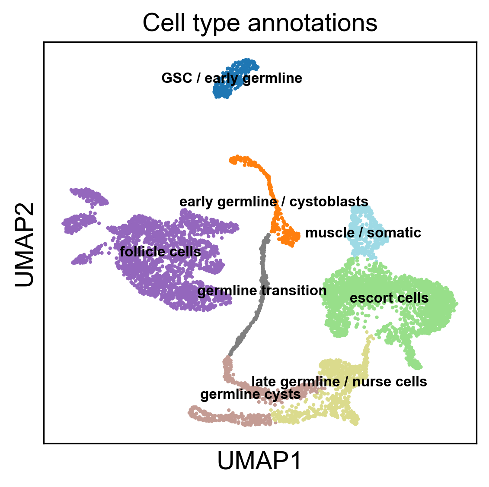
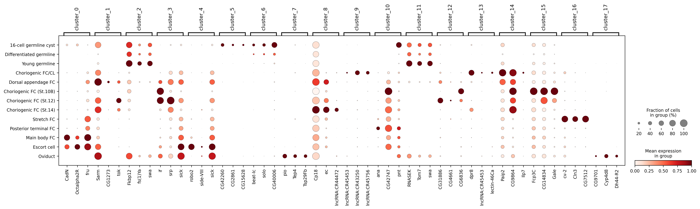

#  🧬 Single-Cell RNA-seq Analysis of Drosophila Ovarian Follicle Cells

BIOENG-420 – Single-cell Biology

| Group 07 - Ovary         | SCIPER  |
|----------------|---------|
| Clotilde Christine Noelle Bévoz    | 346441  |
| Johann Clausen    | 346400  |
| Nafi Anna Dramé    | 340970  |


## Installation

To run the code in this repository, you will need to have Python 3 installed. You can install the required packages using a conda environment and the provided [`environment.yml`](environment.yml) file. 

```bash
conda env create -f environment.yml
conda activate SC_project
```

## Usage
To run the analysis, you can execute the Jupyter notebook [`report.ipynb`](report.ipynb) in the root directory of the repository. This notebook contains all the code for data preprocessing, clustering, marker gene identification, and cell type annotation.

```bash
jupyter notebook report.ipynb
```

## Results
The results of the analysis are presented in the [Jupyter notebook](report.ipynb) or in the [PDF report](report.pdf).

Here are the cell types identified in the dataset and annotated on the UMAP plot:

